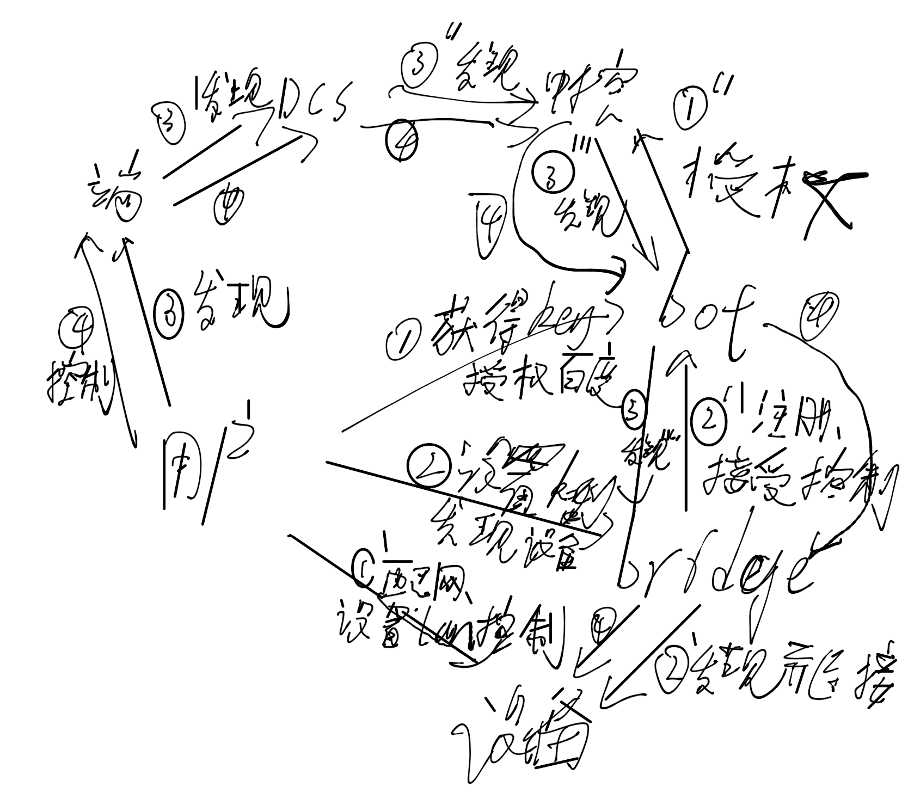

## 整体流程

## bot服务：

    * 对用户
        * 百度第三方登录
        * 授权度秘+生成key，带key跳转回bridge服务
    * 对bridge
        * 接受长连接，管理长连接
    * 对中控
        * 发现设备
        * 控制设备

## bridge 服务
  
[bridge服务](http://wangp.org:8081/wangpeng/duer_iot_local_bridge)
